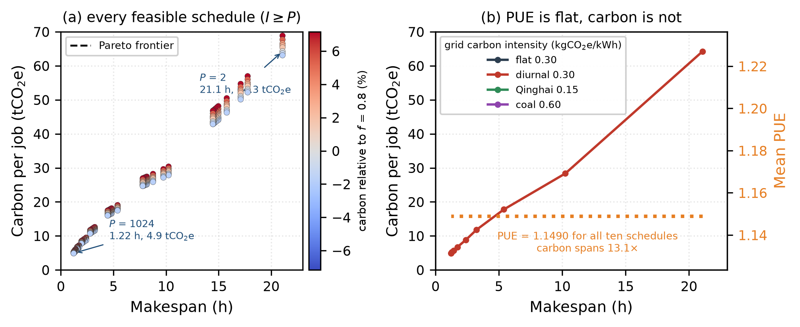
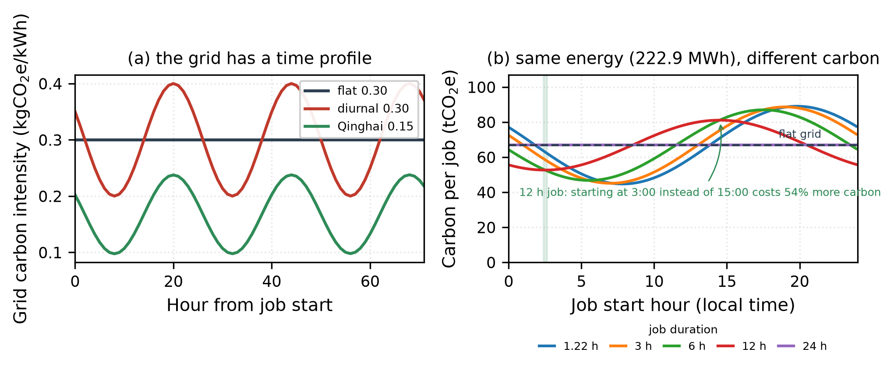
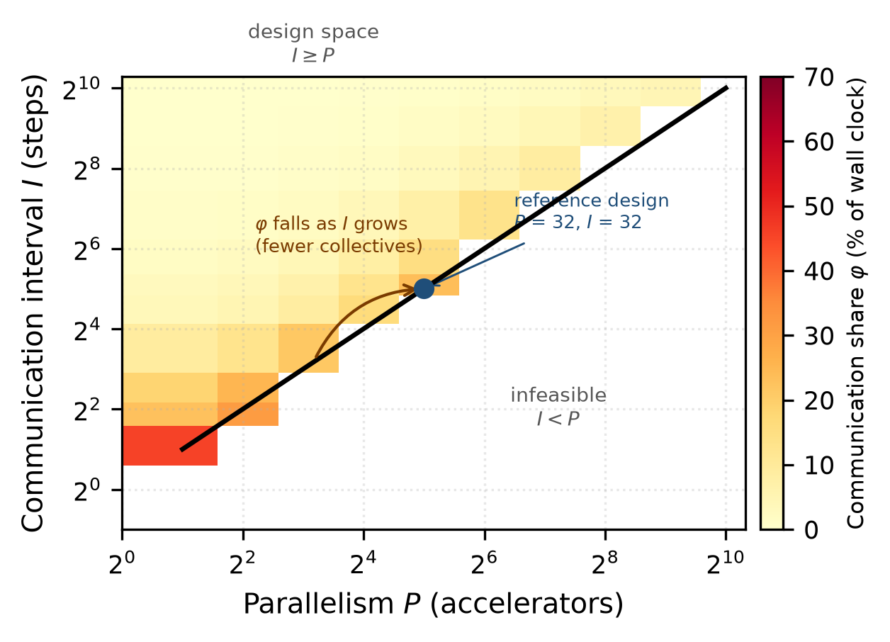

# Why PUE cannot tell you whether a training run is green

**A GPU training-load extension to the high-altitude AI data-centre cooling model**

Xian Cai · School of Intelligent Science and Engineering, Qinghai Minzu University
Companion to the preprint [doi:10.5281/zenodo.22743561](https://doi.org/10.5281/zenodo.22743561)

---

## 1. The question

My earlier work modelled how low air pressure at 2 200 m degrades air-side cooling and
what liquid-cooling fraction *f* recovers it. That model answers a facilities question:
*given an IT load, what PUE does the site achieve?* It takes the IT load as an input and
therefore cannot see the thing that actually determines a training run's energy bill — the
**schedule**: how a job is spread over accelerators, and how often those accelerators stop
computing in order to synchronise.

This study adds that layer. A training job alternates a **compute phase** (tensor cores
busy, power at P_compute) with a **communication phase** (a collective; tensor cores idle,
power falls to P_comm). Every added collective buys wall-clock speed and pays for it in
joules, and because the accelerator idles during it, the *mean* heat load and the *peak*
heat load move in opposite directions. Three layers are now coupled:

```
training schedule  →  IT power and duty cycle        (gpu_training_load.py)
cooling design     →  hourly PUE at plateau ambient  (cooling_model.py)
electricity grid   →  hourly carbon intensity        (CarbonIntensity)
```

## 2. The model in five lines

A job of *N* = 100 000 steps runs at parallelism *P* with a communication interval *I*
(steps between collectives). With throughput Amdahl-limited by a serial fraction *s*, and
a collective whose exposed time is bandwidth-limited at low *P* but hop-limited at high *P*:

$$t_c(P)=\frac{1}{s+(1-s)/P}\qquad t_m(P)=\frac{t_{bw}}{P}+t_{lat}P^{0.5}$$

$$T(P,I)=N\,t_c(P)\Big(1+\varphi\Big),\qquad \varphi=\frac{(N/I)\,t_m(P)}{N\,t_c(P)}$$

$$P_{IT}=n_{gpu}\big[\rho P_{c}+(1-\rho)P_{m}+P_{o}\big],\ \ \rho=\frac{1}{1+\varphi}
\qquad E=P_{IT}\cdot T\cdot \mathrm{PUE}(f,T_{amb})$$

All parameters are in `gpu_training_load.py`; **I ≥ P is a hard floor** (a job on *P*
accelerators cannot synchronise less than once per step), so the design space is triangular.
Reproduce: `python code/gpu_training_scan.py && python code/make_figures_gpu.py`.

## 3. Result 1 — PUE is blind to the schedule

Ten schedules of the *same job* on the *same plant* at Xining (2 266 m, ρ_r = 0.80,
measured TMYx weather), at the density-forced design fraction *f* = 0.80:

| P | I | Makespan | φ | Speed-up | Mean PUE | Grid energy | Carbon |
|---|---|---|---|---|---|---|---|
| 2 | 2 | 21.07 h | 45.9 % | 1.3× | **1.1490** | 222.9 MWh | 64.3 tCO₂e |
| 8 | 10 | 5.39 h | 21.4 % | 5.2× | **1.1490** | 60.3 MWh | 17.8 tCO₂e |
| 32 | 32 | 2.41 h | 23.7 % | 11.6× | **1.1490** | 26.7 MWh | 8.9 tCO₂e |
| 128 | 250 | 1.43 h | 8.6 % | 19.4× | **1.1490** | 16.6 MWh | 5.7 tCO₂e |
| 1024 | 1000 | 1.22 h | 7.0 % | 22.8× | **1.1490** | 14.2 MWh | 4.9 tCO₂e |

**The mean PUE is 1.1490 for all ten rows — identical to four decimal places — while the
carbon per job spans 13.1× and the energy per delivered step spans 15.7×.** PUE is a ratio
of facility power to IT power; it is invariant to how much of that IT power is doing useful
work. A site can report a world-class PUE while its accelerators idle 46 % of the time.

The mechanism is the duty cycle: only ρ moves, from 0.685 to 0.935. Peak IT power stays
pinned at 10.40 MW (the plant must be *built* for it), but the energy actually consumed
ranges from 222.9 MWh down to 14.2 MWh for the same 100 000 steps.



*Fig. 14 — (a) every feasible schedule, coloured by its carbon relative to the f = 0.80
design; (b) carbon against makespan for four grids, with mean PUE overlaid in orange: the
PUE line is flat, so it cannot rank these designs.*

## 4. Result 2 — the marginal carbon cost of speed is fixed by physics

Writing per-accelerator energy as useful work plus overhead,

$$E_{gpu}=\underbrace{P_c N t_c}_{\text{useful}}+\underbrace{P_m\,C\,t_m}_{\text{communication overhead}}$$

the exchange rate is exactly **P_comm × CI** — 0.096 kgCO₂e per accelerator-hour saved on a
0.30 kg/kWh grid, 0.048 on Qinghai's high-renewable grid, 0.192 on a coal-heavy one.
It depends on the idle-phase power and the grid, **never on the cooling design**. Liquid
cooling multiplies both terms by the same PUE, so it cannot change the trade-off; it only
moves a design along it. This is the formal reason why PUE-optimal and carbon-optimal
schedules need not coincide.

## 5. Result 3 — the grid's time profile breaks the PUE↔carbon link

Because the Qinghai plateau grid is hydro + solar + wind dominated, its carbon intensity has
a large daily swing. A job of one hour can be placed in the cleanest window; a job of twelve
hours cannot. Holding energy and PUE fixed, moving a 12 h job's start from 03:00 to 15:00
costs **54 % more carbon**.



*Fig. 17 — (a) hourly grid intensity; (b) identical energy budget, different start hours.*

Now compare the two levers. Across the *entire* cooling range f = 0 → 1, carbon changes by
**9.11 %** — and because the facility model is a pure multiplier on IT power, that 9.11 % is
*exactly the same at every schedule in the scan* (Table: 9.11 % at 1.22 h, at 21.07 h, at
81.16 h). The cooling design cannot interact with the schedule at all. The schedule itself,
by contrast, moves carbon by **13.1×**, and the start hour alone moves it by **54 %** for a
fixed 12 h job.

**The cooling plant is the smaller half of the carbon problem, and the only half that PUE is
capable of measuring.** This is the concrete form of the "PUE-optimal need not be
carbon-optimal" hypothesis: not that the two objectives disagree about *f* — they agree, both
prefer f = 1 — but that PUE is structurally blind to the 13× that scheduling controls.



*Fig. 15 — communication share φ over the triangular (P, I) design space; only I ≥ P is
physical.*

## 6. What this implies for the plateau design

1. **A PUE target is not an energy target.** Report energy-to-solution and carbon per
   delivered step alongside PUE; on this job they differ by more than an order of magnitude
   across schedules that PUE cannot distinguish.
2. **The rack-density constraint is the binding one, not the energy price.** A 41.6 kW rack
   forces *f* ≥ 0.519 at 2 200 m; the carbon-optimal *f* is 1.0 but the whole range is worth
   9 %, so *f* should be set by what the hardware physically requires.
3. **Carbon-aware scheduling beats cooling optimisation** on this grid, but only for jobs
   short enough to fit inside a low-carbon window — which is an argument for finishing
   training runs *faster* (larger *P*), not slower.
4. **Peak, not mean, sizes the plant.** The collective lull is exactly what makes a
   mean-power-sized design look adequate and fail in practice.

## 7. Honest limitations

These are model results, not measurements.

- The power transition between compute and collective phases is treated as a step function.
  Real accelerators slew over tens of milliseconds; for *I* = 1 at 1 s per step this matters.
- `t_bw`, `t_lat` and *s* are literature-typical values for a PCIe-class fabric, not measured
  on this cluster. `JobSpec(t_bw_s=…, t_lat_s=…, s_frac=…)` takes a user's own numbers, and
  every conclusion above is stated with the exchange rates exposed so they can be re-scaled.
- The grid carbon-intensity profiles are parameterised (mean plus daily and seasonal swings),
  not taken from a metered 8 760-hour series. The *direction* of every result follows from the
  profile's amplitude; the magnitude is set by it.
- No CFD, no rack-level thermal coupling, no job-scheduler queueing or preemption model.

## 8. Files

| Path | What it is |
|---|---|
| `code/cooling_model.py` | shared facility model: ISA atmosphere, COP, PUE, weather loader |
| `code/gpu_training_load.py` | the compute/communication phase load model |
| `code/gpu_training_scan.py` | the three-way sweep, writes `data/gpu_scan_*.csv/json` |
| `code/make_figures_gpu.py` | figures 14–18, all read back from the CSVs |
| `data/gpu_scan_training.csv` | 3 520 points: (P, I) × f × 4 grid scenarios |
| `data/gpu_scan_summary.json` | machine-readable headline results and every constant |

```bash
pip install -r requirements.txt
python code/gpu_training_scan.py     # ~60 s, writes the CSV/JSON tables
python code/make_figures_gpu.py      # figures 14-18
```

**Licence** code MIT, text and figures CC BY 4.0. **Contact** caixian901@gmail.com ·
ORCID [0009-0007-5083-7078](https://orcid.org/0009-0007-5083-7078)
