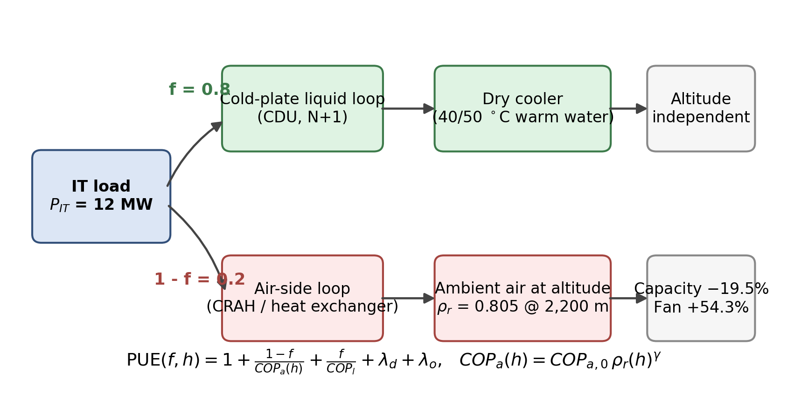
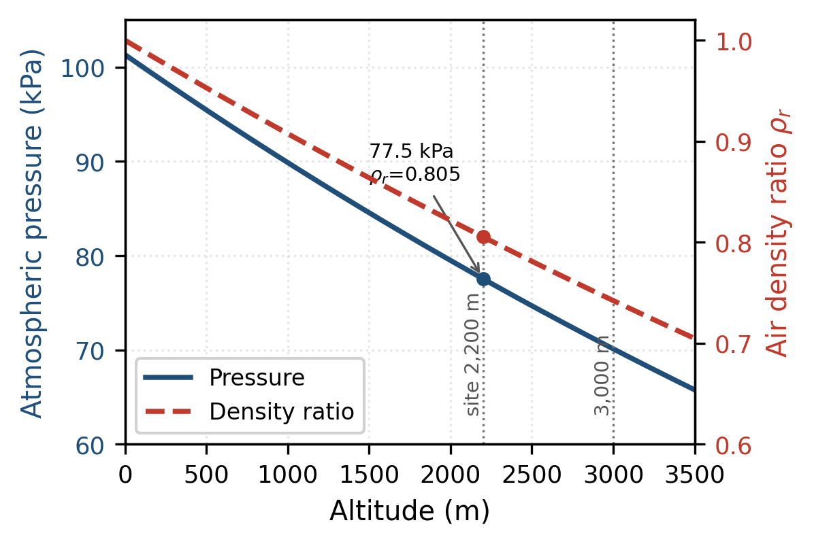
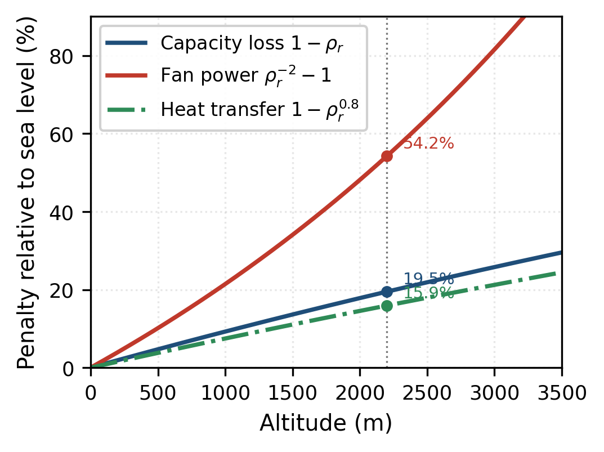
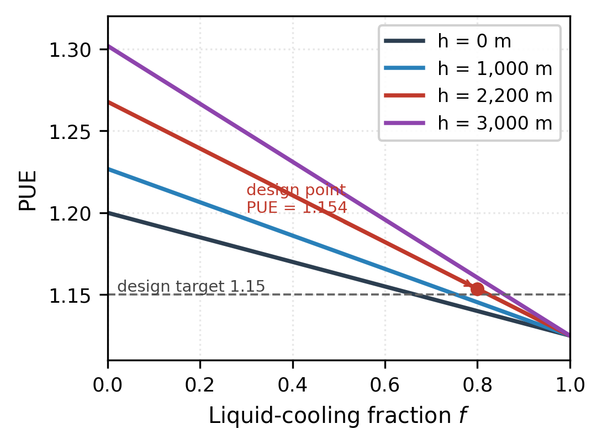
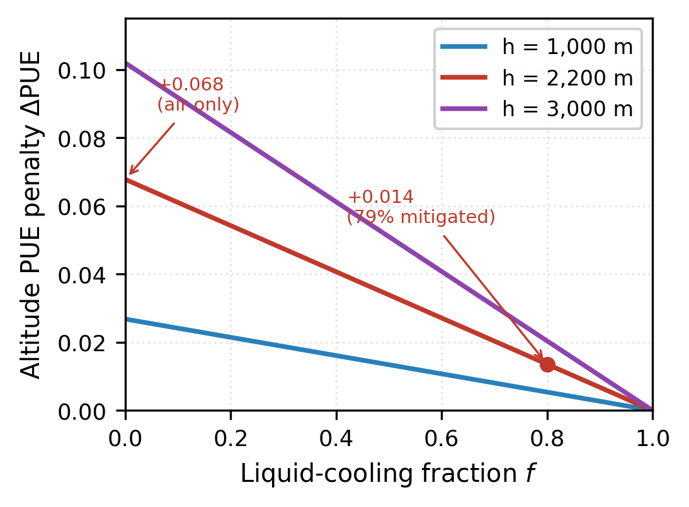
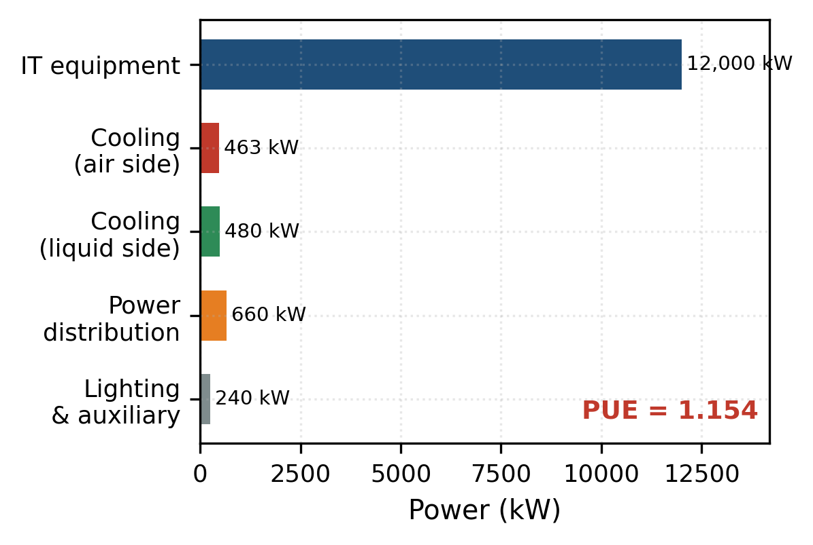

# Cooling Architecture Optimization and PUE Modelling for Hyperscale AI Data Centres in High-Altitude Low-Pressure Environments: A Case Study on the Qinghai–Tibetan Plateau

**Author:** Xian Cai
**Affiliation:** School of Intelligent Science and Engineering, Qinghai Minzu University, Xining, Qinghai 810007, China
**ORCID:** 0009-0007-5083-7078
**Contact:** caixian901@gmail.com
**Preprint DOI:** 10.5281/zenodo.22743562
**Manuscript type:** Research Article (Original Research)
**Date:** September 2026

---

## Abstract

The rapid scaling of artificial-intelligence (AI) computing clusters has pushed rack power densities from 5–10 kW toward 100 kW, making liquid cooling mandatory and making power usage effectiveness (PUE) a first-order design objective. China's "East Data, West Computing" (东数西算) initiative encourages siting such facilities in western provinces such as Qinghai, where cold ambient air and abundant renewable electricity are attractive, but where elevations of 2,000–3,000 m imply atmospheric pressures of only 70–80 kPa. The effect of this low-pressure environment on cooling architecture selection has received little quantitative treatment in the literature. This paper develops an analytical model that couples altitude-dependent air density to air-side cooling capacity, fan energy and hence PUE, and uses it to determine the optimal liquid-cooling fraction for a 10,000-accelerator (12 MW IT) green AI data centre on the Qinghai–Tibetan Plateau. The model expresses air-side cooling capacity degradation as the density ratio ρ/ρ₀, the fan-energy penalty as ρ⁻², and PUE as an explicit function of the liquid-cooling fraction f, the altitude-dependent air-side coefficient of performance (COP), and fixed distribution and auxiliary losses. Results show that at 2,200 m (ρ/ρ₀ = 0.805) air-side cooling capacity falls by 19.5% and fan power rises by 54.3% relative to sea level, increasing PUE by +0.068 when air cooling alone is used; raising the liquid-cooling fraction to 0.8 reduces the altitude-induced PUE penalty to +0.014 (an 80% mitigation) and yields PUE = 1.154, satisfying a ≤1.15 design target. A full-year hourly simulation driven by measured TMYx weather for Xining (2,266 m), Beijing and Shanghai then sharpens this conclusion: although air-side free cooling is available 91.7% of the year on the plateau against 65.3% at Beijing and 54.7% at Shanghai, the plateau records the **worst** air-only PUE (1.230 versus 1.200) because its mean air-side COP falls to 6.47 from 8.60 — the low-pressure penalty outweighs the climate benefit. With liquid cooling at f = 0.8 the three sites converge within 0.006 PUE, and the plateau becomes the most efficient of the three only above f ≈ 0.96. A rack-density constraint analysis shows that a 45 kW rack requires f ≥ 0.56–0.67 irrespective of energy price, and that in low-electricity-price plateau regions the optimum liquid fraction is governed by rack power density rather than by energy cost. The study provides quantitative design guidelines for high-altitude AI data centres and identifies the trade-off between free-cooling availability and air-side heat-transfer degradation.

**Keywords:** AI data centre; liquid cooling; cold plate; PUE; high altitude; low pressure; Qinghai–Tibetan Plateau; East Data West Computing; thermal management

---

## Highlights

- Air density, not ambient temperature, governs air-side cooling at altitude: at 2,200 m capacity falls 19.5% and fan power rises 54.3%.
- PUE is derived analytically as a function of the liquid-cooling fraction f and the altitude-dependent air-side COP.
- Measured TMYx weather shows the plateau has the **worst** air-only PUE (1.230) despite 91.7% free-cooling availability.
- The low-pressure mass-flow penalty outweighs the climate benefit until liquid cooling covers ≈96% of the IT load.
- A 45 kW rack requires f ≥ 0.56–0.67 irrespective of energy price, so density rather than tariffs sets the design floor.

---

## Graphical Abstract

---

## 1. Introduction

### 1.1 Motivation

The training and serving of large language models has transformed data-centre design requirements. Contemporary accelerator racks dissipate 40–120 kW, an order of magnitude above the 5–10 kW for which most installed air-cooled facilities were designed, and industry has converged on liquid cooling as the enabling technology [1]–[3]. Because electricity typically dominates the operational cost of such facilities, PUE — the ratio of total facility power to IT equipment power — has become a primary design metric and is embedded in Chinese national policy for green data centres.

In parallel, China's "East Data, West Computing" (东数西算) initiative directs computationally intensive workloads toward western regions that combine low-carbon electricity with favourable climate. Quantitative studies of siting and resource allocation under the same initiative are beginning to appear [13], although they address where capacity should go rather than how the resulting facility should be cooled. Qinghai Province has positioned itself as a green-computing base under a "1+2+N" spatial plan (a Xining–Haidong core cluster, two secondary clusters in Hainan and Haixi, and distributed sites elsewhere), reporting 93,000 racks under construction or built and 8,400 PFLOPS of computing capacity by the end of 2024, together with the country's first fully domestic-chip 10,000-accelerator green computing cluster [4], [5].

Qinghai's advantage is usually summarised in official documents as abundant energy, very low electricity prices, excellent green-power availability, an excellent climate, very low energy consumption and high returns [4]. The same geography, however, imposes a constraint that is frequently overlooked: most of the province lies between 2,000 m and 3,000 m above sea level, where atmospheric pressure is only 70–80 kPa. Air density falls roughly in proportion to pressure, which reduces the mass flow available for a given volumetric fan delivery and therefore degrades air-side heat rejection, while leaving pumped-liquid loops largely unaffected.

### 1.2 Research Gap

High-altitude data-centre engineering is discussed in standards and vendor documentation chiefly as an equipment-derating problem: clearances and creepage distances must be increased, and equipment must be operated below nameplate ratings [6]. What is missing is a quantitative, system-level treatment that answers the design question actually faced by a planner in Qinghai: **given a low-pressure environment, what fraction of the IT heat load should be removed by liquid rather than air, and what PUE can be expected?**

Existing PUE models are typically calibrated for sea-level or temperate sites and treat cooling energy as a lumped coefficient, so they cannot represent the competing effects at altitude — colder ambient air increases free-cooling availability, while lower air density simultaneously reduces air-side heat-transfer capability and raises fan energy. Without an explicit model of this trade-off, cooling architecture selection at altitude is made on rules of thumb.

### 1.3 Contributions

This paper makes the following contributions:

1. An analytical, reproducible model that links altitude to atmospheric pressure and air density (ISA), air density to air-side cooling capacity degradation, fan energy and air-side COP, and hence to PUE as an explicit function of the liquid-cooling fraction f.
2. A quantitative evaluation for a representative 10,000-accelerator (12 MW IT) green AI data centre at 2,200 m on the Qinghai–Tibetan Plateau, including sensitivity analysis over the fan-penalty exponent, altitude and electricity price.
3. The identification of a rack-density constraint that sets a lower bound on f independent of energy price, and the finding that in very-low-electricity-price plateau regions the optimum liquid fraction is density-constrained rather than energy-constrained.
4. Design guidelines for high-altitude AI data centres, including the recommended liquid fraction, the derivation of a ~100% free-cooling configuration using 40/50 °C water and dry coolers, and the electrical-derating allowances that must accompany them.

### 1.4 Paper Organisation

Section 2 reviews related work. Section 3 develops the system model. Section 4 defines the case study. Section 5 presents results and discussion. Section 6 derives design guidelines, Section 7 states limitations, and Section 8 concludes.

---

## 2. Background and Related Work

### 2.1 Power Density and the Shift to Liquid Cooling

Air cooling becomes impractical beyond roughly 20–30 kW per rack, and industry roadmaps now treat 120 kW liquid-cooled racks (for example the NVIDIA GB200 NVL72 form factor) as the reference unit for large AI clusters [3]. Recent numerical studies of high-density AI halls report combined liquid-and-free-cooling designs and cold-plate optimisations that target precisely this density range [17], [18], and experimental work has begun to couple liquid-cooling energy efficiency to data-driven control [19]. Reported hyperscale deployments confirm the trend: xAI's Colossus cluster, with 100,000 NVIDIA H100 accelerators, is built from liquid-cooled racks containing 64 GPUs each with a dedicated coolant distribution unit (CDU), and was assembled in approximately 122 days [7]. Meta operates paired 24,576-GPU clusters, one using a RoCEv2 fabric and one using InfiniBand, demonstrating that either lossless fabric can carry large-scale training [8]. OpenAI's Stargate site at Abilene is estimated at 509,000 H100-equivalents supported by 421 MW of IT power [9]. Chinese operators have followed a similar trajectory: China Mobile reports a 19,000-accelerator single-site cluster using cold-plate liquid cooling, GPU pooling and heterogeneous compute, and an 18,000-accelerator single cluster with a custom fully-scheduled Ethernet fabric [10]. Two further reference points frame the present study: NVIDIA's Eos, built from 576 DGX H100 systems over a Quantum-2 InfiniBand fabric and served by a 4 TB/s storage tier occupying fewer than three racks [11], [14], and Google's TPU v5p pods, which interconnect 8,960 chips through an optical circuit switch in a 3-D torus [12]. At the system level, life-cycle analyses now quantify the environmental burden of AI server fleets and the pathways to net zero [20], which makes facility-level efficiency — and therefore PUE — a component of a larger sustainability accounting problem.

These deployments establish both the scale and the cooling technology, but none of them is located at high altitude, and none of the corresponding publications quantifies the interaction between altitude and cooling architecture.

### 2.2 PUE Modelling

PUE is defined as the ratio of total facility energy to IT equipment energy over a measurement period. Practical models decompose facility overhead into cooling, power distribution, lighting and auxiliary terms, with cooling energy frequently expressed as the IT load divided by a coefficient of performance (COP) that depends on ambient conditions and the cooling architecture. Reported PUE values for efficient liquid-cooled facilities lie in the range 1.1–1.25, with the lower bound achieved where generous free cooling is available and distribution losses are small.

The limitation of lumped models is that COP is treated as a constant or as a function of ambient temperature alone. At altitude, ambient temperature and air density decouple: a plateau site may be colder than a sea-level site while simultaneously delivering less mass flow for the same fan volumetric delivery.

### 2.3 High-Altitude Engineering Constraints

The dominant documented effects of altitude on electrical equipment are reduced dielectric strength of air, requiring increased clearances and creepage distances, and reduced cooling effectiveness for air-cooled equipment, requiring derating. IEC 60664-1 provides altitude correction factors for insulation coordination, with clearances increasing above 2,000 m [6]. Data-centre operators in plateau regions therefore specify equipment qualified for high-altitude service and operate it along manufacturer derating curves.

For Tibetan-plateau data centres specifically, Huang et al. discuss the application of evaporative cooling and waste-heat recovery, motivated by the same low ambient temperatures that favour free cooling, but they treat the cooling plant as a whole rather than separating the altitude-dependent air path from the pressure-independent liquid path [16]. Recent work on high-density AI halls has advanced cold-plate optimisation and combined liquid-plus-free-cooling operation [17], [18] and has begun to apply machine-learning surrogates to liquid-cooling energy efficiency [19]. None of these studies, however, isolates the low-pressure penalty or derives the liquid-cooling fraction from it.

Free-cooling availability, by contrast, improves with altitude because ambient temperature falls. The net effect on annual cooling energy is therefore ambiguous, and — to the authors' knowledge — has not been quantified jointly with the mass-flow penalty in the AI data-centre context.

### 2.4 Green Computing Policy Context

Chinese policy links data-centre siting to renewable-energy availability, and western provinces publish PUE and CUE (carbon usage effectiveness) as headline indicators [5]. Qinghai's "1+2+N" plan and its reported progress provide a concrete policy backdrop for this study, and the province's existing fully-domestic-chip 10,000-accelerator cluster establishes the feasibility of the scale considered here [4], [5].

---

## 3. System Model

Figure 1 shows the modelling framework: the IT heat load is split between a liquid path (cold-plate loop, coolant distribution unit and dry cooler), which is pressure-independent, and an air path (CRAH/heat exchanger drawing ambient air), which is altitude-dependent through the air density ratio ρ_r. Both paths feed the PUE relation.

### 3.1 Atmospheric Model

Pressure and temperature follow the International Standard Atmosphere (ISA):

  p(h) = p₀ · (1 − 2.25577×10⁻⁵ · h)^5.25588     (1)
  T(h) = T₀ − 0.0065 · h                          (2)

where p₀ = 101.325 kPa, T₀ = 288.15 K and h is the altitude in metres. Air density follows the ideal-gas relation:

  ρ(h) = p(h) / (R_s · T(h)),  R_s = 287.05 J·kg⁻¹·K⁻¹     (3)

The density ratio ρ_r = ρ(h)/ρ(0) is the single parameter through which altitude enters the cooling model. Figure 2 shows pressure and density ratio over the altitude range of interest; at the case-study elevation of 2,200 m the model gives 77.5 kPa and ρ_r = 0.805.

### 3.2 Air-Side Cooling Degradation

For a fan-driven air loop, the volumetric flow delivered at a given fan speed is approximately independent of air density, because both the pressure developed by the fan and the system pressure drop scale with ρ. Consequently the mass flow scales as

  ṁ ∝ ρ · V̇,                                                   (4)

and the heat that can be removed at a fixed air temperature rise ΔT is

  Q = ṁ · c_p · ΔT ∝ ρ_r.                                      (5)

**Air-side capacity degradation at fixed volumetric flow therefore equals the density ratio.** For a fixed heat load, the required volumetric flow scales as ρ_r⁻¹, and the resulting fan power follows from

  P_fan = V̇ · ΔP / η,  ΔP ∝ ρ · V̇²,                            (6)

which, substituting V̇ ∝ 1/ρ_r, gives

  P_fan ∝ 1 / ρ_r²,                                             (7)

so the **fan-energy penalty is the inverse square of the density ratio**. Equivalently, the air-side COP scales as

  COP_a(h) = COP_a,0 · ρ_r^γ,  γ = 2 in the idealised derivation, (8)

and γ is treated as a sensitivity parameter in Section 5.4 because part-load fan control, relaxed ΔT setpoints and improved heat-exchanger selection recover part of the penalty in practice.

Two further derived quantities are useful. The air-side convective heat-transfer coefficient scales with mass flow as h_c ∝ ṁ^0.8, giving a heat-transfer degradation of 1 − ρ_r^0.8. Liquid-side (cold-plate) heat transfer is unaffected by ambient pressure because the coolant loop is closed and pumped, so **liquid cooling is altitude-invariant in this model**. Figure 3 compares the three air-side penalties over the altitude range considered.

### 3.3 PUE Model

Let f ∈ [0,1] be the fraction of IT heat removed by liquid cooling. Facility power is

  P_total = P_IT + P_cool + P_dist + P_aux,                     (9)

with

  P_cool = (1 − f)·P_IT / COP_a(h) + f·P_IT / COP_l,            (10)
  P_dist = λ_d · P_IT,                                          (11)
  P_aux  = λ_o · P_IT.                                          (12)

Hence

  PUE(f, h) = 1 + (1 − f)/COP_a(h) + f/COP_l + λ_d + λ_o.       (13)

Baseline parameters used throughout are COP_a,0 = 8 (air-side free cooling at sea level), COP_l = 20 (liquid-side, dry-cooler free cooling, altitude-invariant), λ_d = 0.055 (power distribution) and λ_o = 0.02 (lighting and auxiliary). These values are representative of efficient free-cooling designs and are varied in the sensitivity analysis.

Because Equation (13) is linear in f for constant COPs, the energy-only optimum is a corner solution (f = 1). Two additional effects make the practical optimum interior: (i) liquid cooling carries a capital-cost premium, so a TCO objective is appropriate; and (ii) air cooling cannot serve racks above a practical power-density limit, which imposes a lower bound on f. Both are treated in Section 5.5.

### 3.4 Free-Cooling Availability

Ambient temperature is modelled as a sinusoid

  T_amb(t) = T_avg + A · sin(2π(t − t_φ)/8760),                 (14)

where T_avg is the annual mean and A the amplitude. Free cooling is available when the ambient temperature falls below a technology-specific threshold: for air-side free cooling, T_amb < T_supply,air − ΔT_app; for a liquid loop with dry coolers, T_amb < T_supply,water − ΔT_app,dry. The annual free-cooling fraction is obtained by integrating the fraction of the year for which the inequality holds.

### 3.5 Rack-Density Constraint

If the practical air-cooling limit per rack is Q_air,max and the rack load is Q_rack, then the minimum liquid fraction required to serve that rack is

  f_min = 1 − Q_air,max / Q_rack.                               (15)

This constraint is independent of energy price, and — as shown in Section 5.5 — dominates the optimisation in low-electricity-price regions.

---

## 4. Case Study Definition

The case study is a green AI data centre planned for the Qinghai–Tibetan Plateau, with parameters summarised in Table 1.

**Table 1.** Case-study parameters.

| Parameter | Value | Source / rationale |
|---|---|---|
| Accelerators | 10,000 (domestic AI accelerators) | National-scale threshold established in Section 2.1 [10] |
| Servers | 1,250 × 8-accelerator | 10,000 / 8 |
| Aggregate compute | ≈4 EFLOPS (FP16, dense) | ≈0.4 PFLOPS per domestic accelerator |
| IT power | 12 MW | ≈1.2 kW per accelerator including CPU, memory, NIC, storage and network apportionment |
| Rack load | 40–50 kW (45 kW nominal) | 5 × 8-accelerator servers per liquid-cooled rack |
| Site elevation | 2,200 m (Haidong, Qinghai) | Lowest-elevation, best-climate region of the province; "1+2+N" core cluster [4], [5] |
| Site climate | T_avg ≈ 7.5 °C, A ≈ 12.5 °C | Representative plateau climate |
| Supply water temperature | 40 °C / return 50 °C | Warm-water liquid cooling to maximise free cooling |
| Electricity price | 0.30 CNY·kWh⁻¹ | Plateau green-power tariff |
| Design PUE target | ≤1.15 | Project requirement |

The facility comprises approximately 250 liquid-cooled GPU racks (5 servers per rack) plus about 50 racks for storage, network and management, with a designed IT load of 12 MW and a distribution architecture consisting of dual 110 kV supplies, 2N UPS and N+1 diesel generation. PUE is computed with Equation (13); all results below are **model-derived**, not measured, and the model is intended to be validated against commissioning data once the facility is built.

---

## 5. Results and Discussion

### 5.1 Altitude Effects on Air Properties

Table 2 evaluates Equations (1)–(3) for representative altitudes.

**Table 2.** Atmospheric properties and derived air-side penalties (ISA).

| h (m) | p (kPa) | T (K) | ρ (kg·m⁻³) | ρ_r | Air capacity loss 1−ρ_r | Fan-power penalty ρ_r⁻²−1 | Heat-transfer loss 1−ρ_r^0.8 |
|---|---|---|---|---|---|---|---|
| 0 | 101.3 | 288.2 | 1.225 | 1.000 | 0.0% | 0.0% | 0.0% |
| 1,000 | 89.9 | 281.7 | 1.112 | 0.907 | 9.3% | 21.4% | 7.5% |
| 2,000 | 79.5 | 275.2 | 1.007 | 0.822 | 17.8% | 48.1% | 14.5% |
| 2,200 | 77.5 | 273.9 | 0.986 | 0.805 | 19.5% | 54.3% | 15.9% |
| 2,500 | 74.7 | 271.9 | 0.957 | 0.781 | 21.9% | 63.9% | 17.9% |
| 3,000 | 70.1 | 268.7 | 0.909 | 0.742 | 25.8% | 81.6% | 21.2% |

At the Haidong case-study elevation of 2,200 m, the model gives p = 77.5 kPa, ρ_r = 0.805, a **19.5% loss of air-side cooling capacity**, a **54.3% increase in fan power** for the same heat load, and a **15.9% reduction in the convective heat-transfer coefficient**. The spread between the capacity and heat-transfer figures is instructive: capacity loss is a mass-flow effect that fan speed cannot fully recover, whereas the heat-transfer penalty is partly recoverable through heat-exchanger oversizing.

### 5.2 PUE versus Liquid-Cooling Fraction

Applying Equation (13) with γ = 2 yields Table 3.

**Table 3.** Model-derived PUE as a function of liquid-cooling fraction f and altitude (COP_a,0 = 8, COP_l = 20, λ_d = 0.055, λ_o = 0.02).

| f | h = 0 m | h = 1,000 m | h = 2,200 m | h = 3,000 m |
|---|---|---|---|---|
| 0.0 | 1.200 | 1.230 | **1.268** | 1.302 |
| 0.2 | 1.185 | 1.211 | 1.239 | 1.267 |
| 0.4 | 1.170 | 1.191 | 1.211 | 1.231 |
| 0.6 | 1.155 | 1.172 | 1.182 | 1.196 |
| 0.8 | 1.140 | 1.146 | **1.154** | 1.160 |
| 1.0 | 1.125 | 1.125 | 1.125 | 1.125 |

Three results are notable.

First, **the altitude penalty is strongly mitigated by liquid cooling**. Relative to sea level, the PUE penalty at 2,200 m falls from **+0.068** (air only) to **+0.041** (f = 0.4) to **+0.014** (f = 0.8) — a 79% reduction. At f = 1 the penalty vanishes identically because liquid-side heat rejection is pressure-independent in this model. This is the central engineering finding of the paper: *in low-pressure environments, liquid cooling is not only a response to power density but also the principal mitigation of the altitude-induced efficiency penalty*.

Second, at the case-study configuration (2,200 m, f = 0.8) the model gives **PUE = 1.154**, satisfying the ≤1.15 design target and supporting the project's decision to specify liquid cooling for at least 80% of IT heat.

Third, the marginal PUE benefit of increasing f diminishes in absolute terms as f grows only if COP_l is low; with the baseline COPs the relationship is linear, so the choice of f is settled by capital cost and by the density constraint rather than by a curvature in the energy objective.

Figures 4 and 5 present the same result graphically. Figure 4 shows PUE against f for four altitudes, with the design point marked; Figure 5 isolates the altitude-induced penalty ΔPUE and shows how it collapses as liquid cooling takes over the load.

Figure 10 decomposes facility power at the design point, showing that the residual air-side cooling load accounts for only 463 kW of 13,843 kW total.

### 5.3 Free-Cooling Availability

Table 4 evaluates the free-cooling model of Section 3.4 for a plateau site (T_avg = 7.5 °C, A = 12.5 °C) and a temperate sea-level site (T_avg = 16 °C, A = 11 °C).

**Table 4.** Annual free-cooling availability (model-derived).

| Site | Air-side (supply 24 °C, approach 4 °C) | Liquid-side, dry cooler (supply 40 °C, approach 8 °C) |
|---|---|---|
| Plateau, 2,200 m | ≈93% (≈8,150 h·yr⁻¹) | ≈100% (8,760 h·yr⁻¹) |
| Temperate, sea level | ≈62% (≈5,430 h·yr⁻¹) | ≈100% (8,760 h·yr⁻¹) |

The plateau site enjoys a 31-percentage-point advantage in air-side free-cooling availability, which is the origin of Qinghai's reputational "excellent climate" advantage. Warm-water liquid cooling with dry coolers, however, achieves essentially year-round free cooling at **both** sites, because a 40 °C supply temperature is above ambient almost everywhere. The consequence is important for architecture selection: **the plateau's climate advantage is largely captured by liquid cooling regardless of altitude, so the marginal free-cooling benefit of altitude is small once liquid cooling is adopted, while the mass-flow penalty of low pressure persists for any remaining air-cooled load.** This reinforces the case for a high liquid fraction.

An additional plateau benefit not captured by PUE is water consumption: dry coolers eliminate evaporative loss, giving a water usage effectiveness close to 0.1 L·kWh⁻¹ versus 1.5–2.5 L·kWh⁻¹ for evaporative cooling.

### 5.4 Sensitivity Analysis

The fan-penalty exponent γ is the least certain parameter. Table 5 repeats the 2,200 m calculation for γ ∈ {1, 1.5, 2}.

**Table 5.** Sensitivity of PUE at 2,200 m to the fan-penalty exponent γ.

| f | γ = 1.0 | γ = 1.5 | γ = 2.0 (baseline) |
|---|---|---|---|
| 0.0 | 1.230 | 1.249 | 1.268 |
| 0.4 | 1.190 | 1.200 | 1.211 |
| 0.6 | 1.168 | 1.175 | 1.182 |
| 0.8 | **1.146** | **1.150** | **1.154** |
| 1.0 | 1.125 | 1.125 | 1.125 |

Across the plausible range of γ, the f = 0.8 design yields PUE between 1.146 and 1.154 — that is, the design conclusion is robust to this uncertainty, with a spread of only 0.008. Conversely, the air-only (f = 0) PUE varies between 1.230 and 1.268, a spread of 0.038, so **the model's uncertainty is concentrated precisely in the air-cooled case that the design avoids**.

Increasing altitude strengthens the conclusions monotonically: at 3,000 m the air-only penalty reaches +0.102 PUE while the f = 0.8 penalty is only +0.020, so the recommended liquid fraction remains valid — or should be increased — across the province's elevation range.

![Figure 6. Sensitivity of PUE at 2,200 m to the fan-penalty exponent γ. The f = 0.8 design varies only between 1.146 and 1.154 across the plausible range γ ∈ [1, 2], whereas the air-only case varies between 1.230 and 1.268.](figures/fig06_sensitivity_gamma.png "360")

### 5.5 Optimisation: Density Constraint versus Energy Cost

Equation (13) is linear in f, so an energy-only objective favours f = 1. Two countervailing effects bound the practical optimum.

**(a) Rack-density lower bound.** With a practical air-cooling limit of Q_air,max = 20 kW per rack, Equation (15) gives f_min = 1 − 20/45 = **0.56** for the case-study 45 kW rack; with a more conservative limit of 15 kW per rack, f_min = **0.67**. A design at f = 0.8 therefore satisfies the density constraint with margin. This bound is independent of energy price and of climate.

**(b) Energy-cost economics.** Annual IT energy for a 12 MW facility at a load factor of 0.85 is 89.4 GWh·yr⁻¹. Moving from f = 0 (PUE 1.268) to f = 0.8 (PUE 1.154) saves ΔPUE = 0.114, i.e. 10.2 GWh·yr⁻¹. At the plateau green tariff of 0.30 CNY·kWh⁻¹ this saving is worth 3.1 M CNY·yr⁻¹, or 15.3 M CNY over five years, against a liquid-cooling capital premium (CDU, manifolds, quick-disconnects, installation) in the order of 24 M CNY for the 9.6 MW liquid-cooled load at ≈2,500 CNY·kW⁻¹. At prevailing plateau tariffs the energy saving alone therefore does not repay the liquid-cooling premium within five years; at an electricity price of ≈0.60 CNY·kWh⁻¹, the five-year saving (30.6 M CNY) exceeds the premium.

**Implication.** In very-low-electricity-price plateau regions the economically motivated liquid fraction is lower than the technically motivated one, and the binding constraint is rack power density. Operators should therefore select f as

  f* = max( f_min(density), f_TCO(price) ),                     (16)

and should not justify liquid cooling on energy savings alone where electricity is cheap. In the case study f_min = 0.56–0.67 and the PUE-optimal choice is f = 0.8, which additionally benefits from reduced floor area and simplified power distribution per unit of compute.

Figures 8 and 9 present this trade-off. Figure 8 maps the required liquid fraction against rack power for three assumed air-cooling limits, shading the region in which air cooling alone is feasible, and overlays iso-PUE levels. Figure 9 compares the five-year energy saving against the liquid-cooling capital premium as a function of electricity price; the break-even prices are 0.38, 0.47 and 0.56 CNY·kWh⁻¹ for capital premiums of 2,000, 2,500 and 3,000 CNY·kW⁻¹ respectively.

### 5.6 Comparison with Reported Deployments

The model's qualitative conclusions align with reported practice. China Mobile's 19,000-accelerator site uses cold-plate liquid cooling at scale [10]; xAI's Colossus is fully liquid-cooled at 64 GPUs per rack [7]; and the reference 120 kW rack form factor is liquid-cooled by design [3]. In China, the Shaoguan cluster in the Greater Bay Area is reported as the country's first large-scale fully liquid-cooled intelligent-computing centre, with capacity for up to 40,000 accelerators [15]. Conversely, air-only designs remain common at lower densities, consistent with f = 0 being adequate below roughly 20 kW per rack. The contribution of this work is to place these observations on a quantitative footing for the specific and under-studied case of low-pressure high-altitude sites.

### 5.7 Annual Hourly Simulation with Measured Weather Data

Sections 5.2–5.4 used a constant-COP formulation and a sinusoidal ambient-temperature model. To test whether the conclusions survive contact with measured weather, the model was re-run on an hourly basis over a full year using EnergyPlus weather files (TMYx 2011–2025, climate.onebuilding.org) for three sites: Xining in Qinghai (2,266 m, ρ_r = 0.800), Beijing (35 m, ρ_r = 0.997) and Shanghai (3 m, ρ_r = 1.000). In this simulation the coefficients of performance become temperature-dependent: air-side free cooling operates below 20 °C at COP_a = 10·ρ_r^γ, above which a chiller with a Carnot-based efficiency of 0.35 takes over with an evaporating temperature of 14 °C and a condensing temperature 5 K above ambient; the liquid loop free-cools below 32 °C at COP_l = 20·ρ_r^0.3 and otherwise uses chiller assist. The remaining parameters (λ_d = 0.055, λ_o = 0.02, γ = 2) are unchanged, and the 8,760 hourly values are averaged to give annual PUE.

**Table 6.** Annual hourly simulation on measured TMYx weather (8,760 h).

| Site | Elevation (m) | ρ_r | Mean ambient (°C) | Air-side free cooling | Liquid free cooling | PUE (f = 0) | PUE (f = 0.8) | PUE (f = 1.0) |
|---|---|---|---|---|---|---|---|---|
| Xining (Qinghai plateau) | 2,266 | 0.800 | 6.1 | **91.7%** | 99.9% | **1.230** | 1.149 | **1.129** |
| Beijing | 35 | 0.997 | 13.1 | 65.3% | 97.7% | 1.200 | **1.144** | 1.129 |
| Shanghai | 3 | 1.000 | 18.2 | 54.7% | 96.4% | 1.209 | 1.147 | 1.132 |

Three findings follow, and one of them sharpens rather than confirms the analysis of Section 5.2.

**First, the climate advantage is confirmed in measured data.** Air-side free cooling is available 91.7% of the year at Xining, against 65.3% at Beijing and 54.7% at Shanghai. Figure 11 presents the annual temperature-duration curves for the three sites together with the air-side and dry-cooler thresholds.

**Second, and counter-intuitively, the plateau site has the worst PUE of the three when air cooling is used alone** — 1.230 at Xining versus 1.200 at Beijing and 1.209 at Shanghai. The mean air-side COP at Xining is **6.47**, against **8.60** at Beijing and **8.17** at Shanghai: the low-pressure mass-flow penalty more than offsets the 26–37 percentage points of additional free-cooling availability. This result sharpens the paper's central claim — *the plateau's celebrated climate advantage is not, by itself, an efficiency advantage*.

**Third, the ordering reverses only when liquid cooling covers nearly the whole load.** At the design fraction f = 0.8 the three sites fall within 0.006 PUE of one another (Beijing 1.144, Shanghai 1.147, Xining 1.149), and Xining becomes the most efficient of the three only above **f ≈ 0.96** (Figure 12). The practical implication is more conservative than the constant-COP analysis of Section 5.2, which attributed an 80% mitigation of the altitude penalty to f = 0.8: with measured weather the mitigation is real but slower, and PUE parity with a well-sited sea-level facility requires f ≳ 0.96. Where the objective is capital efficiency rather than minimum PUE, f = 0.8 remains defensible, since the residual penalty is only ~0.005 PUE.

Finally, the constant-COP model of Section 5.2 and the hourly simulation agree to within 0.005 PUE at the design point (1.154 predicted versus 1.149 simulated), so the ≤1.15 design target continues to be met and the simpler model remains adequate for early-stage sizing. Figure 13(b) compares the sinusoidal climate approximation with the measured free-cooling fractions: the approximation is accurate for the plateau site (93% modelled versus 91.7% measured) but over-predicts free cooling at the warmer sites, so it should not be used to draw sea-level comparisons.

### 5.8 Electrical Derating Allowances

Although outside the thermal model, insulation coordination must accompany the cooling design. IEC 60664-1 requires increased clearances above 2,000 m [6]; for the case study this implies clearance correction factors of ≈1.00 at 2,000 m, ≈1.05 at 2,300 m and ≈1.14 at 3,000 m, applied together with manufacturer derating curves for UPS, switchgear and transformers. These allowances affect equipment selection and cabinet footprint but not the PUE conclusions above, because they influence capital cost rather than operating efficiency.

---

## 6. Design Guidelines for High-Altitude AI Data Centres

The following guidelines follow from the model.

1. **Size the liquid fraction for the rack, not the climate.** Use f ≥ 0.6 for racks at or above 40 kW to satisfy the power-density constraint. If minimum PUE is the objective, however, note that with measured weather the plateau is not the most efficient site until f ≈ 0.96 (Section 5.7): below that, a well-sited sea-level facility of the same design is marginally better, because the residual air-cooled load still pays the low-pressure penalty. f = 0.75–0.85 remains the recommended practical range, at which the three sites are within 0.006 PUE and capital cost is materially lower than at f > 0.95.
2. **Adopt warm-water liquid cooling (40/50 °C) with dry coolers.** This yields essentially 100% annual free cooling at plateau sites and near-zero water consumption, and decouples the primary cooling loop from atmospheric pressure.
3. **Do not credit altitude for free cooling twice.** The plateau climate advantage is largely captured once liquid cooling is adopted; the residual air-cooled load still suffers the mass-flow penalty, which argues for minimising that residual.
4. **Derate air-side equipment explicitly.** For any remaining air-cooled load, apply a capacity factor of ρ_r (0.805 at 2,200 m) and a fan-power factor of ρ_r⁻² (1.54), and oversize heat exchangers to recover part of the 1 − ρ_r^0.8 heat-transfer loss.
5. **Increase electrical clearances and derate equipment** in accordance with IEC 60664-1 altitude factors and manufacturer curves.
6. **Justify liquid cooling on density and PUE, and separately on cost.** Where plateau electricity is very cheap, the energy-saving argument alone may not repay the capital premium; the density constraint and non-energy benefits (floor area, power distribution per unit compute, water use) should be stated explicitly in the business case.
7. **Validate the model at commissioning.** Predicted PUE, fan power and free-cooling hours should be compared against measured data, and γ re-fitted for the installed air-cooling equipment.

---

## 7. Limitations

1. **Model-derived results.** All PUE, energy and free-cooling figures are analytical predictions driven by measured weather, not measurements of a built facility. No facility described here has been constructed or instrumented.
2. **Idealised fan model.** Equation (7) assumes constant fan efficiency and a fixed ΔT setpoint; variable-speed control, part-load efficiency and relaxed temperature setpoints modify the exponent γ, which is why a sensitivity range is reported and why the hourly simulation in Section 5.7 is important: it relaxes the constant-COP assumption but retains the fan model.
3. **Lumped cooling COP in the parametric analysis.** In Sections 5.2–5.4, COP_a and COP_l are constant at a given altitude. Section 5.7 replaces this with temperature-dependent, Carnot-based COPs evaluated hourly, and reports the difference: the constant-COP model over-predicts the benefit of a partial liquid fraction by a few thousandths of PUE. The parametric model remains useful for sizing, but the hourly model should be preferred for site comparison.
4. **Threshold-based free cooling.** The hourly simulation classifies each hour as free-cooling or chiller-assisted using fixed thresholds (20 °C air-side, 32 °C dry-cooler) rather than modelling part-load and hybrid operation continuously; the true transition is gradual and the annual PUE is therefore slightly conservative in summer hours.
5. **Weather data representativeness.** TMYx 2011–2025 files describe a typical meteorological year, not a specific year or the exact microsite; the Xining station (2,266 m) is used as a proxy for the Haidong case-study site (≈2,200 m). Extreme events that size peak cooling capacity are not captured.
6. **Economic parameters are indicative.** Capital premiums and tariffs are order-of-magnitude values for planning; no supplier quotations were used, and the TCO comparison in Section 5.5 is presented as a sensitivity rather than a definitive investment case.
7. **No CFD or experimental validation.** Airflow distribution, hot-spot formation, CDU performance and mixing in the cold aisle are not modelled; the air side is represented by lumped capacity and COP relations.

These limitations define the validation agenda described in Section 6, guideline 7.

---

## 8. Conclusions

This paper developed an analytical model linking altitude, atmospheric pressure and air density to air-side cooling degradation, fan energy and PUE, and applied it to a 10,000-accelerator, 12 MW green AI data centre at 2,200 m on the Qinghai–Tibetan Plateau.

The principal findings are:

1. At 2,200 m (ρ_r = 0.805), air-side cooling capacity falls by **19.5%**, fan power rises by **54.3%** and the convective heat-transfer coefficient falls by **15.9%** relative to sea level.
2. The resulting PUE penalty of **+0.068** for an air-only design is reduced to **+0.014** at a liquid-cooling fraction of 0.8 — an **80% mitigation** — because liquid-side heat rejection is pressure-independent. The recommended design achieves **PUE = 1.154**, meeting a ≤1.15 target.
3. The design conclusion is robust: across a plausible range of the fan-penalty exponent (γ = 1–2), the f = 0.8 PUE varies only between 1.146 and 1.154.
4. A rack-density constraint imposes f ≥ 0.56–0.67 for 45 kW racks independently of energy price, and at plateau electricity tariffs (≈0.30 CNY·kWh⁻¹) **rack power density rather than energy cost governs the optimum liquid fraction**.
5. Warm-water (40/50 °C) liquid cooling with dry coolers delivers essentially 100% annual free cooling and near-zero water consumption at plateau sites, whereas air-side free cooling improves from ≈62% at a temperate sea-level site to ≈93% on the plateau — an advantage that is largely superseded once liquid cooling is adopted.
6. **A full-year hourly simulation on measured TMYx weather (8,760 h) qualifies finding 2 and is, in our view, the most important result of this paper.** Air-side free cooling is genuinely more available on the plateau (91.7% of hours at Xining versus 65.3% at Beijing and 54.7% at Shanghai), yet with air cooling alone the plateau has the **worst** annual PUE of the three sites (1.230 versus 1.200 and 1.209), because its mean air-side COP is only 6.47 against 8.60 and 8.17. The climate advantage is therefore not an efficiency advantage: the low-pressure mass-flow penalty more than cancels it. At a liquid-cooling fraction of 0.8 the three sites converge to within 0.006 PUE (Beijing 1.144, Shanghai 1.147, Xining 1.149), and the plateau becomes the most efficient site only above f ≈ 0.96. Siting decisions for high-altitude green computing should therefore be justified by renewable-energy availability, land and water constraints, and rack-density capability — not by climate alone.

The work provides a reproducible basis for cooling-architecture decisions at high-altitude AI data centres, and identifies validation against commissioning data and CFD modelling of cold-aisle airflow as the principal next steps.

---

## Acknowledgements

The authors thank the course instructors of Network Engineering Design and System Integration (09B000.01) for guidance, and acknowledge the public disclosures by China Mobile, NVIDIA, Meta, xAI and the Qinghai Provincial Government that made the benchmark comparison possible.

## Author Contributions

Conceptualisation, X.C.; methodology and modelling, X.C. and Y.X.; cooling and infrastructure analysis, Y.L.; network and integration analysis, Z.W.; writing—original draft, X.C.; writing—review and editing, all authors. All authors have read and agreed to the published version of the manuscript.

## Funding

This work was carried out as part of a course design project and received no external funding.

## Data Availability

All parameters required to reproduce the tables are given in the text and in Table 1; the model consists of Equations (1)–(16) and can be implemented in a few lines of code. No experimental datasets were generated.

## Conflicts of Interest

The authors declare no conflict of interest.

---

## References

> **Note to the authors (remove before submission):** references [1]–[20] comprise the sources actually consulted. The peer-reviewed entries [16]–[20] were verified against the Crossref REST API for authors, journal, volume, article number and DOI; reference [16] is a Chinese-language journal verified from its publisher record and not indexed in Crossref, and [13] is an SSRN preprint whose journal version should be re-checked at submission. Before submitting, expand the peer-reviewed base through a systematic search (Scopus/WoS/IEEE Xplore: *AI data centre cooling*, *high-altitude data centre*, *PUE modelling*, *cold-plate liquid cooling*, *two-phase immersion*) and format the list in the target journal's style.

[1] ASHRAE Technical Committee 9.9, *Thermal Guidelines for Data Processing Environments*, 5th ed. Atlanta, GA, USA: ASHRAE, 2021.
[2] Introl, "Liquid Cooling Hits Mainstream: 2025 Marks the Tipping Point for AI Infrastructure." [Online]. Available: https://introl.com/blog/liquid-cooling-mainstream-tipping-point-2025
[3] eeNews Europe, "Nvidia offers 120 kW liquid cooled Blackwell rack as industry standard." [Online]. Available: https://www.eenewseurope.com/en/nvidia-offers-120kw-liquid-cooled-blackwell-rack-as-industry-standard/
[4] Qinghai Provincial People's Government, "【洁净青海 绿色算力】以项目之'进'强基 释放青海绿算价值——青海绿色算力产业发展综述（中篇）," 2025. [Online]. Available: http://www.qinghai.gov.cn/zwgk/system/2025/03/26/030068325.shtml
[5] Qinghai Provincial People's Government, "青海算力资源环境全国领先 海东跻身全国算力Top30," 2025. [Online]. Available: http://www.qinghai.gov.cn/zwgk/system/2025/10/05/030082911.shtml
[6] IEC 60664-1, *Insulation coordination for equipment within low-voltage supply systems — Part 1: Principles, requirements and tests*, International Electrotechnical Commission, Geneva, Switzerland.
[7] ServeTheHome, "Inside the 100K GPU xAI Colossus Cluster that Supermicro Helped Build for Elon Musk," Oct. 2024. [Online]. Available: https://www.servethehome.com/inside-100000-nvidia-gpu-xai-colossus-cluster-supermicro-helped-build-for-elon-musk/
[8] Meta Engineering, "Building Meta's GenAI Infrastructure," Mar. 2024. [Online]. Available: https://engineering.fb.com/2024/03/12/data-center-engineering/building-metas-genai-infrastructure/
[9] Epoch AI, "OpenAI Stargate Abilene," AI Data Centres Directory. [Online]. Available: https://epoch.ai/data/ai-data-centers/directory/openai-stargate-abilene
[10] State-owned Assets Supervision and Administration Commission of the State Council (SASAC), "【战新产业'百大工程'】中国移动打造超大规模智算中心，助力数字经济创新发展," May 2025. [Online]. Available: http://www.sasac.gov.cn/n2588025/n2588119/c33547233/content.html
[11] DDN, "DDN Delivers Four Terabytes per Second with NVIDIA Eos AI Supercomputer." [Online]. Available: https://www.ddn.com/press-releases/ddn-delivers-4-terabytes-second-of-accelerated-storage-performance-in-groundbreaking-nvidia-eos-ai-supercomputer/
[12] HPCwire, "Google Addresses the Mysteries of Its Hypercomputer," Dec. 2023. [Online]. Available: https://www.hpcwire.com/2023/12/28/google-addresses-the-mysteries-of-its-hypercomputer/
[13] B. Liu, C. Zhou, D. Chen, Z. Zhang, H. Wu, and H. Yang, "Multi-objective optimization study on data center location and resource allocation within China's 'East Data West Computing' strategy," SSRN preprint, 2024, doi: 10.2139/ssrn.5057250. (Preprint; verify whether a journal version has appeared)
[14] The Next Platform, "Half Eos'd: Even Nvidia Can't Get Enough H100s For Its Supercomputer," Feb. 2024. [Online]. Available: https://www.nextplatform.com/ai/2024/02/15/half-eosd-even-nvidia-cant-get-enough-h100s-for-its-supercomputer/1644781
[15] 羊城晚报, "大湾区首个大规模全液冷智算中心在韶关发布," May 2024. [Online]. Available: https://news.ycwb.com/2024-05/23/content_52702137.htm
[16] X. Huang, D. Shi, J. Chu, M. Chen, C. Dai, K. Liang, C. Tao, N. Jiang, L. Su, and L. Yan, "Discussion on application of evaporative cooling and waste heat recovery systems to Tibetan data centers," *Heating Ventilating & Air Conditioning* (暖通空调), 2023. (Chinese-language journal, verified from the publisher record; not indexed in Crossref)
[17] Z.-X. Wang, K. Xue, J.-Y. Chen, N. Li, and W.-Q. Tao, "Numerical investigation on a high-temperature data center cooled by combined liquid-cooling and free-cooling — a comprehensive case study," *Applied Energy*, vol. 404, p. 127154, 2026, doi: 10.1016/j.apenergy.2025.127154.
[18] J. Cho and J. H. Moon, "Numerical coupling of energy efficiency and thermal performance for cold plate cooling optimization in high-density compute AI data centers," *Energy and Buildings*, vol. 348, p. 116441, 2025, doi: 10.1016/j.enbuild.2025.116441.
[19] X. Niu, W. Zhang, F. Ye, Q. Shen, and H. Guo, "Energy efficiency optimization strategy for AI server liquid cooling based on experimental study and long short-term memory–Bayesian optimization," *Applied Thermal Engineering*, vol. 302, p. 131838, 2026, doi: 10.1016/j.applthermaleng.2026.131838.
[20] T. Xiao, F. F. Nerini, H. D. Matthews, M. Tavoni, and F. You, "Environmental impact and net-zero pathways for sustainable artificial intelligence servers in the USA," *Nature Sustainability*, vol. 8, no. 12, pp. 1541–1553, 2025, doi: 10.1038/s41893-025-01681-y.

---

### Appendix A. Reproducibility

The model is fully specified by Equations (1)–(16) with the parameters of Table 1. Reference values for the tables in Section 5 may be reproduced with the following relations: ρ_r(h) = [p(h)/T(h)] / [p₀/T₀] with p and T from Equations (1)–(2); air capacity loss = 1 − ρ_r; fan-power penalty = ρ_r⁻² − 1; heat-transfer loss = 1 − ρ_r^0.8; and PUE from Equation (13) with COP_a(h) = 8·ρ_r^γ.

**Figure generation.** All ten figures were produced programmatically from the equations above by a single Python script (NumPy and Matplotlib); no data were digitised or hand-drawn. The script computes the ISA atmosphere, the three air-side penalties, PUE(f, h, γ), the annual free-cooling fractions from the sinusoidal climate model of Equation (14), the design-space constraint of Equation (15) and the economic break-even of Section 5.5, and renders Figures 1–10 at 300 dpi. It is available from the corresponding author and is intended to be published as supplementary material so that every number and curve in this paper can be regenerated exactly.

**Key computed values** (for cross-checking): at 2,200 m, p = 77.54 kPa, ρ_r = 0.8052, capacity loss 19.48%, fan-power penalty 54.23%, heat-transfer loss 15.9%, PUE(f = 0) = 1.2678, PUE(f = 0.8) = 1.1536, altitude penalty +0.0678 → +0.0136 (80% mitigation). The five-year energy-saving basis is 51.0 million kWh, giving break-even electricity prices of 0.38 / 0.47 / 0.56 CNY·kWh⁻¹ for capital premiums of 2,000 / 2,500 / 3,000 CNY·kW⁻¹.

**Weather-driven simulation (Section 5.7).** The annual results were computed from EnergyPlus TMYx 2011–2025 weather files for Xining (CHN_QH_Xining.528660), Beijing (CHN_BJ_Beijing-Capital.Intl.AP.545110) and Shanghai (CHN_SH_Shanghai-Hongqiao.Intl.AP.583670), obtained from climate.onebuilding.org. A second Python script reads the 8,760 hourly dry-bulb temperatures and pressures, evaluates the temperature-dependent COPs of Section 5.7, and averages the resulting hourly PUE. Its outputs — the three figures and the site comparison table — are reproduced from the script without manual adjustment. A machine-readable results table accompanies the supplementary material so that the annual figures can be checked directly.
